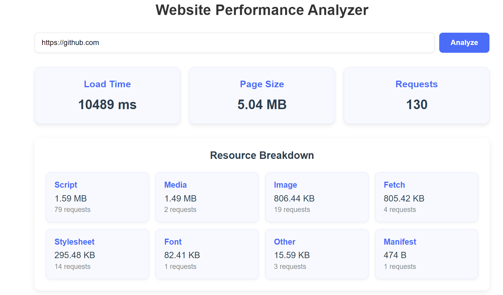

# Website Performance Analyzer

[](https://reactjs.org/)
[](https://expressjs.com/)
[](https://pptr.dev/)
[](https://opensource.org/licenses/MIT)

A comprehensive web performance analysis tool that measures critical website metrics including load time, page size, and resource requests.



## Features

- ⚡ **Real-time Performance Metrics**
  - Total page load duration
  - Aggregate resource size (HTML, CSS, JS, images)
  - Number of HTTP requests
- 📊 **Resource Breakdown**
  - Detailed analysis by resource type (scripts, images, stylesheets, etc.)
  - Size and request count per resource category
- 🔍 **Headless Browser Analysis**
  - Uses Puppeteer for accurate real-browser measurements
  - Captures lazy-loaded content and dynamic resources
- 🎨 **Modern UI**
  - Clean, responsive interface
  - Visual metrics cards
  - Color-coded resource breakdown
---

## How It Works

The application consists of a React frontend and an Express backend that uses Puppeteer to analyze website performance:

1. User enters a URL in the React interface
2. Frontend sends URL to backend API
3. Backend launches headless Chrome with Puppeteer
4. Puppeteer:
   - Navigates to the URL
   - Measures load time
   - Collects performance metrics
   - Calculates total page size
   - Counts network requests
5. Backend calculates resource breakdown by type
6. API returns metrics to frontend
7. React displays results in card format with resource breakdown
---

## Tech Stack

- **Frontend**: 
  - React 18
  - Custom Hooks for state management
  - CSS Grid/Flexbox for responsive layout
- **Backend**:
  - Express.js
  - Puppeteer (Headless Chrome)
  - CORS middleware
- **Development Tools**:
  - Node.js 16+
  - npm 8+


### Prerequisites
- Node.js 16+
- npm 8+

### Setup Instructions

1. Clone the repository:
```bash
git clone https://github.com/your-username/website-performance-analyzer.git
cd website-performance-analyzer
```
---

## Installation of Backend dependencies

```bash
cd Backend 
npm install
```

## Installation of Frontend dependencies

```bash
cd Frontend
npm install 
```

## Running the backend server

```bash
cd Backend
node server.js
```

## Running the frontend server

```bash
cd Frontend
npm run dev
```

---

## Contributing

Contributions are welcome! Please follow these steps:

1. **Fork** the repository
2. **Create a new feature branch**  
   ```bash
   git checkout -b feature/your-feature
   ```
3. **Commit your changes**  
   ```bash
   git commit -m 'Add some feature'
   ```
4. **Push to the branch**  
   ```bash
   git push origin feature/your-feature
   ```
5. **Open a pull request**

### Contribution Guidelines

- Follow existing code style and patterns
- Write clear commit messages
- Include relevant documentation updates
- Ensure all tests pass
- Keep PRs focused on a single feature or bug

---

## License

This project is licensed under the MIT License - see the [LICENSE](LICENSE) file for details.

---

## Roadmap

- Add performance comparison between URLs
- Implement historical metrics tracking
- Add Lighthouse integration
- Create PDF report generation
- Develop browser extension version

---

## Common Issues

### Puppeteer fails to launch

- Ensure you have the correct version of Node.js installed
- Check Puppeteer documentation for advanced options

### CORS errors

- Verify backend is running on port 5000
- Use Chrome DevTools to inspect network requests

---

## Support

For additional help, open an issue on GitHub.

---

Developed with ❤️ by Aashish
